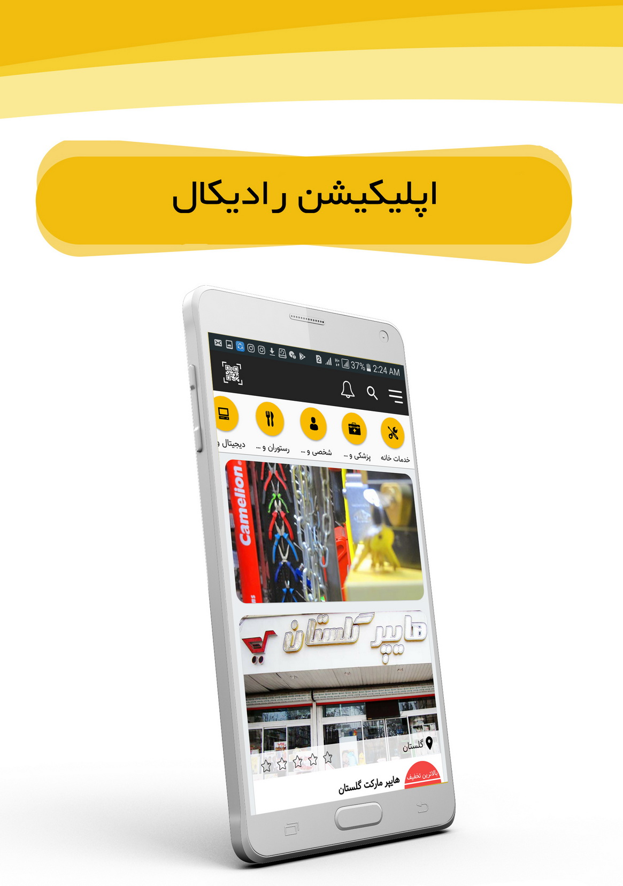
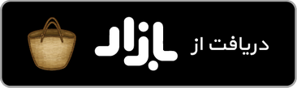

# Radical

  

Reduce the cost of living with Radical

# Features
Radical is a powerful app with complete features for reducing your daily, monthly and yearly costs. We provide you shops, services, spas… with special discounts for radical users.
Radical helps you decrease your costs up to 40% by offering the best without any limitation.
Features:
1-	User-friendly and simple user interface
2-	Shop’s rating system
3-	Your own personal wallet
4-	Stats and information about your purchases
5-	Sharing with friends
6-	Online chat with support
7-	Advanced searching capability
8-	View and save receipts feature
And so much more…
** Only available in Iran, Kermanshah **
And soon in your city :)

# Download

  

   

# Developed By

* Shahab Azimi
 * [shahabazimi.ir](http://shahabazimi.ir) - <azimishahab@gmail.com>

# License

    Copyright 2019 Shahab Azimi

    Licensed under the Apache License, Version 2.0 (the "License");
    you may not use this file except in compliance with the License.
    You may obtain a copy of the License at

       http://www.apache.org/licenses/LICENSE-2.0

    Unless required by applicable law or agreed to in writing, software
    distributed under the License is distributed on an "AS IS" BASIS,
    WITHOUT WARRANTIES OR CONDITIONS OF ANY KIND, either express or implied.
    See the License for the specific language governing permissions and
    limitations under the License.
